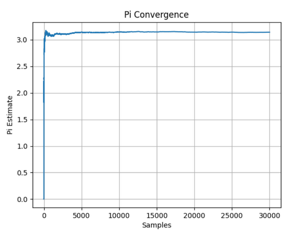
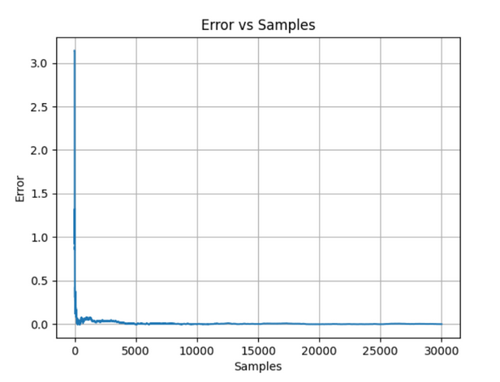
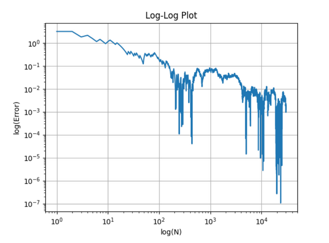

## Results Preview


# Estimation of Pi Using Random Sampling

## Abstract

This project estimates the value of π using a simple random sampling method. Random points are generated inside a unit square, and the fraction of points lying inside a quarter circle is used to approximate π.

---

## Theory

For a unit square with a quarter circle of radius 1:

* Area of square = 1
* Area of quarter circle = π/4

Thus,

π ≈ 4 × (Points inside circle / Total points)

Error decreases as:

Error ∝ 1/√N

---

## Method

1. Generate random points (x, y) in [0,1]
2. Check if x² + y² ≤ 1
3. Count points inside the circle
4. Estimate π

---

## Code (Scilab)

```scilab id="08ul9p"
clc;
clear;

N = 100000;
inside = 0;

for i = 1:N
    x = rand();
    y = rand();
    
    if (x^2 + y^2 <= 1) then
        inside = inside + 1;
    end
end

pi_est = 4 * inside / N;

disp(pi_est);
```

---

## Results

Estimated value of π ≈ **3.14**

---

## Plots

### π Convergence


### Error vs Samples



### Log-Log Error Plot



---

## Conclusion

The method provides a simple way to estimate π. Accuracy improves with more samples, although convergence is slow and follows inverse square root behavior.

---

## Author

Ayush Kumar Samal
